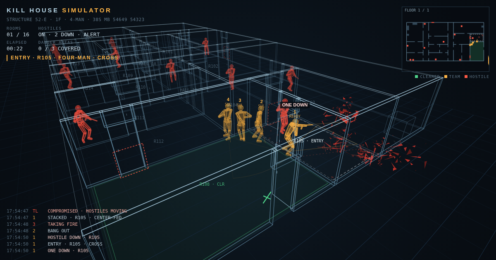

# Kill House Simulator

A CQB screensaver in 3D wireframe. A team of one to four endlessly clears randomly generated, multi-floor kill houses: stacking, breaching, slicing the pie, quick peeks, entries, clearing by sight, and reacting to hostiles that hear, move and fire back.

**Live:** https://ntddk.github.io/kill-house-simulator/



## Controls

| Key | Action |
|---|---|
| C / 1–6 | Camera: cycle / auto, orbit, follow, chase, helmet, plan |
| H | Hostiles on / off |
| T | Team size (4 → 3 → 2 → 1) |
| S | Speed ×1 / ×2 / ×4 |
| P, Space | Pause |
| N | New map |
| I | Hide / show HUD |
| F | Fullscreen |
| D | Debug overlay (states, stances, seen %) |

The buttons at the bottom right cover the main ones. The team size, the hostiles setting, the camera and the speed are remembered in the browser.

## What it models

- **Buildings:** 1–3 floors, BSP rooms, hallways and T-intersections, switchback stairwells with landings, furniture, doors with random hinge and swing (open leaves are solid), locked doors.
- **Before entry:** danger areas covered while moving; stacks that respect door swing; ballistic or mechanical breach; quick peek; slicing the pie; flashbang. When a hostile is already known in the room, the team skips the slow techniques and goes in on momentum.
- **Entry and clearing:** cross, buttonhook and crisscross (the direction comes from the door, unless the team already knows where the threat or the unseen part of the room is); points of domination; a room is only called clear once it has actually been seen; dead space checked; rooms marked.
- **Muzzle discipline:** low, compressed and high ready and SUL, angled outboard off teammates. Nobody fires past a teammate or through a wall. The shooter switches to the left shoulder at a left-hand jamb.
- **Hostiles:** hear footsteps, voices and doors; turn to noise; push, fall back or wait in ambush once compromised. The team hears them moving too, and reacts to contact.

References: FM 3-06.11 *Combined Arms Operations in Urban Terrain* (ch. 3) and MCWP 3-35.3 *Military Operations on Urbanized Terrain*. This is a screensaver, not a training aid.

## Development

The page is built from plain files; there are no dependencies.

```
src/meta.html  src/head.html  src/body.html   markup and styles
src/p1.js      map generation, pathing, geometry
src/p2.js      team and hostile behaviour
src/p3.js      rendering, HUD, controls
tools/         headless verification (Node)
```

```sh
./build.sh                                          # -> dist/index.html (one self-contained page)
node tools/check.js                                 # CI gate: a few deterministic maps per team size
SEED=7 node tools/verify.js dist/index.html 10 1500 4   # full metrics: 10 maps, 1500 s each, team of 4
```

Every push to `main` runs the build and the gate, then deploys `dist/` to GitHub Pages (`.github/workflows/pages.yml`).

## License

MIT — see [LICENSE](LICENSE).
